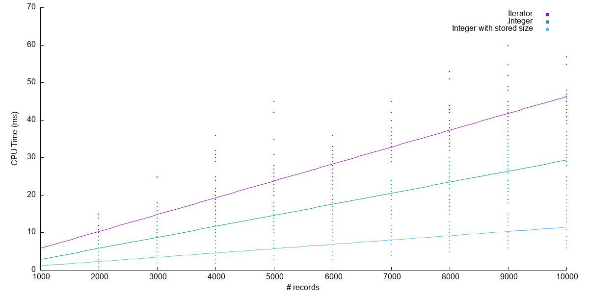

# Apex Performance Testing

This package helps you to test the performance of Apex code. It factors in the variation that we might expect to see 
from one run to another in Apex. It runs the tests multiple times and then plots the results using a CLI plugin.

You write a test with three parts: `setup`, `run`, and `teardown`. The package will run `setup`, will measure CPU time
for the `run` part, then run `teardown`. 

Each run is performed inside separate transaction. Depending on the configuration that you choose, this could be as 
a Queueable job, a Platform Event Trigger, or in a Queueable Finalizer. The framework then chains 
together the required runs to measure performance multiple times and at multiple input sizes. 

The result of a test run is a number of `PerformanceMeasureResult__c` records with the size and measured CPU time for 
each run.

These results can then be plotted to compare different ways of solving the same problem. Or just to find out how a single
solution scales. 

## Installation

We built the package in two versions: 

1. A no-namespace Unlocked Package
2. An Unlocked Package in our own namespace (`mantra`)

The namespaced version is so that the package can be installed into scratch orgs for ISV packages. (SF does not allow 
non-namespaced Unlocked Packages to be installed into namespaced scratch orgs).

Either:

- Paste this onto the end of your My Domain URL: 
  - No namespace: /packaging/installPackage.apexp?p0=04tWS000000JKPdYAO
  - Namespaced: /packaging/installPackage.apexp?p0=04tWS000000JKcXYAW
- Include in your SFDX project as 
  - "Apex Performance Testing": "04tWS000000JKPdYAO"
  - "Apex Performance Testing Namespaced": "04tWS000000JKcXYAW"

If you just have some isolated experiments to run, then cloning this repository and making your experiment in here works well, too. 
## Some free performance tuning advice

Before using this package to optimise for performance, look at the architecture of your system.

What's better than saving 5% or 10% of the CPU time required for an operation?

**Realising that you don't need to do the operation at all!**

The most painful performance problems come from doing unnecessary work, or using data structures/algorithms that are
inappropriate for the scale of the problem, or trying to squeeze more things into a single transaction when the work
could be split up.

Doing fewer things is where the big gains are.

Once you're doing the fewest thing, then you can consider using this package to do them in the fastest way.

Even then, faster is not always better. Readability and flexibility should be balanced against performance.
If your code becomes harder to read for a minor speed improvement, that might not be worthwhile trade.

With all that said, I hope this package does help you to make better informed decisions about efficiency in Apex!


## Example Usage: Types of for loops

There are two ways to write a for loop in Apex:

1. As an iterator
2. Using an integer index

The first format is generally considered to be more readable. The second is more efficient. But how much more efficient?
That's a good question to be answered by this framework.

To write a performance scenario to be tested, we implement the `PerformanceScenario` interface.

In this case, we will do so by defining the `setup` and `teardown` methods of a `PerformanceScenario`:

```apex
public abstract class LoopPerformanceScenario extends PerformanceScenario {

  protected List<Integer> data;

  public override void setup(Integer size) {
    data = new List<Integer>(size);

    for (Integer i = 0; i < size; i++) {
      data[i] = i;
    }
  }
}
```

This creates an in-memory list of integers to process in the `run` method. We have chosen to use inheritance to bring 
the same `setup` and `teardown` methods into each of the scenarios that we will define later. But inheritance is not 
the only way to achieve this - you can do it any way that you like. It is, however, required that each scenario you 
write implements the `PerformanceScenario` interface.

Given that superclass, each actual test is very small:

Iterator loop:
```apex
public class IteratorLoopPerformanceScenario extends LoopPerformanceScenario {
  public override void run() {
    Integer sum = 0;
    for(Integer n : data) {
      sum += n;
    }
  }
}
```

All we care about is loop performance, so we sum up the `data` values to give some sort of operation in the loop body. 

Integer-indexed loop:
```apex
public class IntegerLoopPerformanceScenario extends LoopPerformanceScenario {

  public override void run() {
    Integer sum = 0;
    for(Integer i=0; i < data.size(); i++) {
      sum += data[i];
    }
  }
}
```

Integer-indexed loop where we store the list length at the beginning of the loop:
```apex
public class IntegerStoredSizeLoopPerformanceScenario extends LoopPerformanceScenario {
    public override void run() {
        Integer sum = 0;
        for(Integer i=0, size=data.size(); i < size; i++) {
            sum += data[i];
        }
    }
}
```

To group together running these tests, and to define the parameters for running them, use an instance of the 
`PerformanceSuite` class. By implementing `PerformanceSuiteRunner`, we allow the suite to be run later by the CLI plugin:

```apex
public with sharing class LoopPerformanceSuite implements PerformanceSuiteRunner {

  public static PerformanceSuite.Response run() {
    return new PerformanceSuite('LoopPerformance', new List<PerformanceScenario>{
            new IntegerLoopPerformanceScenario(),
            new IteratorLoopPerformanceScenario(),
            new IntegerStoredSizeLoopPerformanceScenario()
    }, PerformanceTestingMode.PLATFORM_EVENTS)
            .setStartSize(1000)
            .setStepSize(1000)
            .setEndSize(10000)
            .setRepetitions(20)
            .clearExistingResults()
            .run();
  }
}
```

Here we configure lots of things at once:

 - The name of the suite (the `PerformanceResult__c` records will carry that name so that you can easily query for 
the relevant ones).
 - The list of class instances implementing `PerformanceScenario` that should be run. Note that they are stateful, so you might well need that `teardown` method. `setup` is called before each `run`, though, so that could also be enough.
 - The input sizes to run at. This is just passed to `setup`, so your `PerformanceScenario` can decide what size means for your scenario. 
 - The number of iterations to run at each size
 - An instruction to clear any existing records for this suite before starting.

When you run `LoopPerformanceSuite.run()`, the testing will begin. There is no callback to tell you that it's complete, so just let it run 
until there are enough results.

The section below describes one way to analyse the data, but you can use any tools/techniques that you prefer. To cut
to the chase, here is a plot of the loop results



You can see from this that the integer-indexed loop where we store the size before going into the loop is the most 
efficient.

So we can conclude that for performance-critical code, this is the best method to use. However, the iterator
version does remove potential slips like having nested loops and mixing up the loop variables 
(e.g. writing `i` when you meant `j`), so iterators may be preferred when performance is not critical.

## Different modes of testing

There are 3 ways you can do performance Testing with this library:
1. **QUEUEABLE**: Runs each performance test scenario in queueable mode, and chain the next execution in finalizer
2. **PLATFORM_EVENTS**: Runs each performance test scenario in synchronous mode, and chain the next execution by firing platform event
3. **QUEUEABLE_FROM_FINALIZER**: Runs each performance test scenario in queueable mode(from finalizer class), and chain the next execution in finalizer

### Examples
To run your test suite in 1 of three mode send 3rd parameter to `PerformanceSuite` constructor

for QUEUEABLE

```apex
    new PerformanceSuite('LoopPerformance', new List<PerformanceScenario>{
                new IntegerLoopPerformanceScenario(),
                new IteratorLoopPerformanceScenario(),
                new IntegerStoredSizeLoopPerformanceScenario()
        }, PerformanceTestingMode.QUEUEABLE)
                .setStartSize(1000)
                .setStepSize(1000)
                .setEndSize(10000)
                .setRepetitions(20)
                .clearExistingResults()
                .run();
```

for PLATFORM_EVENTS
```apex
    new PerformanceSuite('LoopPerformance', new List<PerformanceScenario>{
                new IntegerLoopPerformanceScenario(),
                new IteratorLoopPerformanceScenario(),
                new IntegerStoredSizeLoopPerformanceScenario()
        }, PerformanceTestingMode.PLATFORM_EVENTS)
                .setStartSize(1000)
                .setStepSize(1000)
                .setEndSize(10000)
                .setRepetitions(20)
                .clearExistingResults()
                .run();
```

for QUEUEABLE_FROM_FINALIZER
```apex
    new PerformanceSuite('LoopPerformance', new List<PerformanceScenario>{
                new IntegerLoopPerformanceScenario(),
                new IteratorLoopPerformanceScenario(),
                new IntegerStoredSizeLoopPerformanceScenario()
        }, PerformanceTestingMode.QUEUEABLE_FROM_FINALIZER)
                .setStartSize(1000)
                .setStepSize(1000)
                .setEndSize(10000)
                .setRepetitions(20)
                .clearExistingResults()
                .run();
```

### Which mode should I use?

When selecting a mode for performance testing, consider the nature of your test scenarios and the specific limitations of each mode:

- **Use Queueable Mode** for simpler scenarios where additional queueable jobs are not required.
- **Use QUEUEABLE_FROM_FINALIZER Mode** when you need to handle post-test actions but are not concerned with fatal errors stopping execution.
- **Use PLATFORM_EVENTS Mode** for scenarios that benefit from asynchronous processing and do not require accurate CPU time tracking when DML operations are involved.

By understanding these modes and their constraints, you can effectively utilize this framework to gain valuable insights into your Apex code's performance under various conditions.

Note: if 3rd parameter is not specified, default mode is QUEUEABLE_FROM_FINALIZER

## Analysing the data

This section describes how to analyse the data with [@processity/cli-performance-testing](https://github.com/processity/cli-performance-testing).

### Requirements

1. You have the [Salesforce CLI](https://developer.salesforce.com/docs/atlas.en-us.sfdx_setup.meta/sfdx_setup/sfdx_setup_install_cli.htm) installed.
2. The latest version of the [apex-performance-testing](https://github.com/processity/apex-performance-testing) unlocked package is installed in your target Salesforce org.
3. You have the [@processity/cli-performance-testing](https://github.com/processity/cli-performance-testing) installed.
4. The target Salesforce org is authenticated using the Salesforce CLI and is set as the default org for your project repository.
5. An Apex Performance suite is created and deployed in your org.

To install  the performance testing CLI plugin, run:

```zsh
sf plugins install @processity/cli-performance-testing
```

### Operation

Run the following script:

```zsh
 sf performance test run --name <MyPerformanceSuiteName>
 ```

This script performs the following steps:

1. Start the performance suite execution
2. Display a live progress bar
3. Generate a PDF report with graphs once the execution is complete.

After plotting, you will see the results in the `PerformanceTestReport.pdf`

So, for the loop performance example, we run the follow:

```zsh
sf performance test run --name LoopPerformanceSuite
```